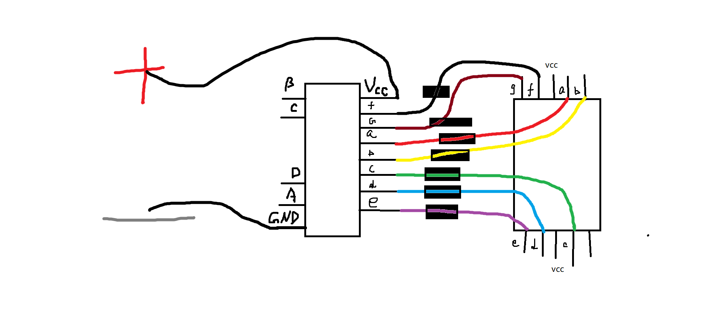

# digital-clock

本项目旨在帮助同学们**快速**完成**EEE116**数字时钟的代码开发。

## 先觉条件
 - 新版Arduino可能无法运行，请使用1.8.5版本(下载地址：[win](https://cloud.yimian.xyz/install/arduino/1.8.5/arduino-1.8.5-windows.zip) / [mac](https://cloud.yimian.xyz/install/arduino/1.8.5/arduino-1.8.5-macosx.zip))
 - 下载并解压代码到本地([代码下载戳这里](https://github.com/IoTcat/digital-clock/archive/master.zip))
 - **请务必先解压，否则代码无法运行**
 - 请保证包含代码文件的文件夹名称为`digital-clock`
 
## 快速开始
 - 用Arduino IDE打开digital-clock.ino文件
 - 根据需求编辑`定义初始参数`部分
 - 代码其它部分如不明白请**不要改动**
 - 之后正常编译上传即可

## 参数说明
代码注释比较详细，我直接copy过来如下
````C++
/*** 定义初始参数 ****/

//小组组号
#define GROUP_ID 22 //计时器增大到此值将重新从零开始
                    //例如此处我的组号是22

//时钟变换时间间隔 (毫秒)
#define INTERVAL_TIME 1000 //默认是1秒

//pin口 - 接译码器1 (显示个位)
#define DIG_1_1 9   //A
#define DIG_1_2 10  //B
#define DIG_1_3 11  //C
#define DIG_1_4 12  //D

//pin口 - 接译码器2 (显示十位)
#define DIG_2_1 5   //A
#define DIG_2_2 6   //B
#define DIG_2_3 7   //C
#define DIG_2_4 8   //D

//pin口 - 接开关
#define SWI_OFF 3

//pin口 - 接reset键
#define SWI_RESET 4

````
## 其它资料
译码器与显示器连法(由[番茄树](https://tomatotrees.xyz)同学提供)


## 背景资料
自豪地引用[**ovo.h**](https://github.com/eeeneko/arduino-ovo)搭建非阻塞Arduino程序框架！

