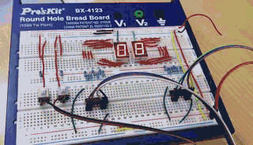
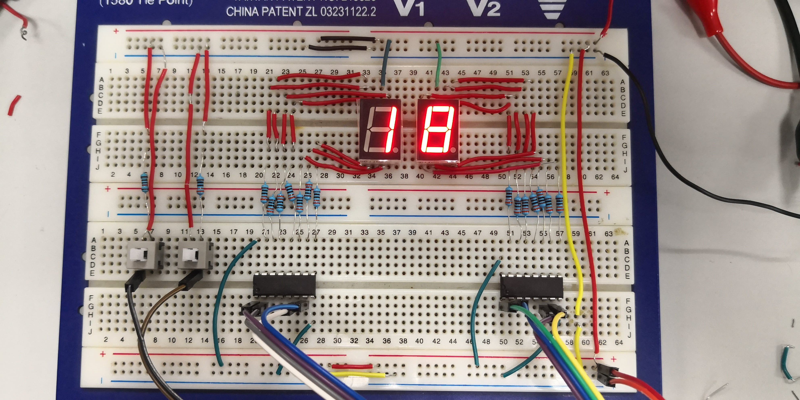
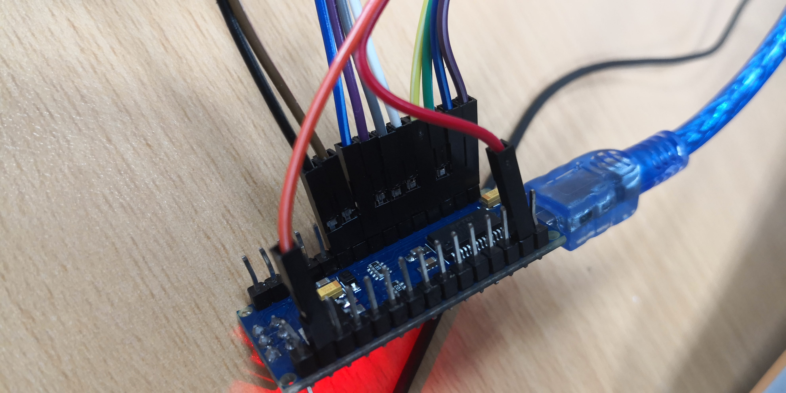
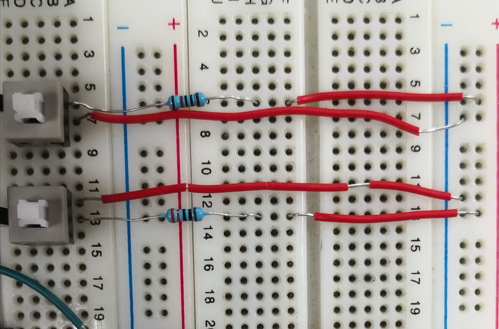
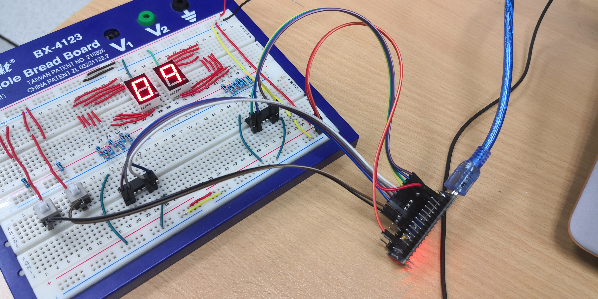
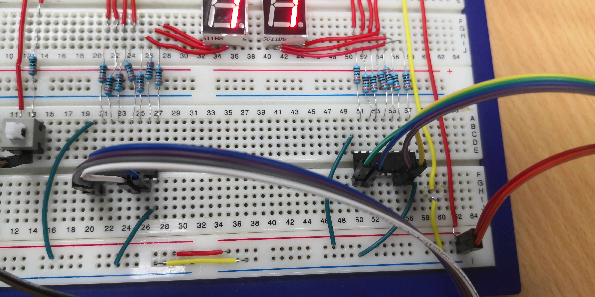
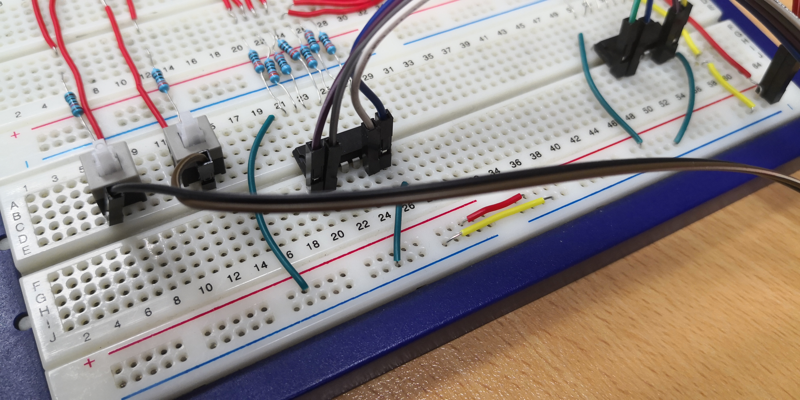
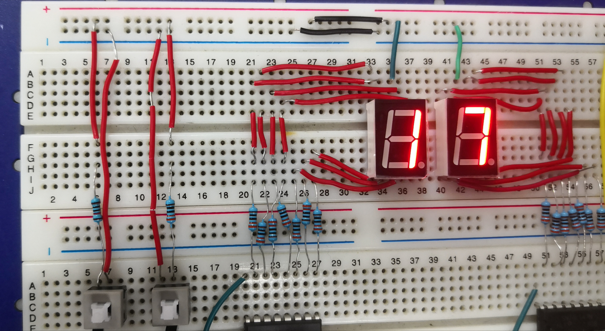
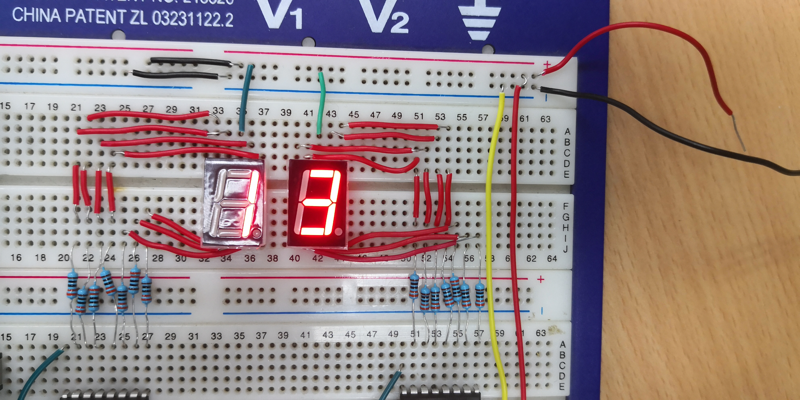

# digital-clock

本项目旨在帮助同学们**快速**完成**EEE116**数字时钟的代码开发。

## 先觉条件(非常重要！！任何一条不满足你的代码就无法运行)
 - 新版Arduino可能无法运行，请使用1.8.5版本(下载地址：[win](https://cloud.yimian.xyz/install/arduino/1.8.5/arduino-1.8.5-windows.zip) / [mac](https://cloud.yimian.xyz/install/arduino/1.8.5/arduino-1.8.5-macosx.zip))
 - 下载并解压代码到本地([代码下载戳这里](https://github.com/IoTcat/digital-clock/archive/master.zip))
 - **请务必先解压，否则代码无法运行**
 - 请保证包含代码文件的文件夹名称为`digital-clock`
 
## 相关资料
### 效果图

### 电路实物图
请参考以下图片搭建你的电路！

### Arduino Nano推荐连法


### 译码器连法
译码器与显示器连法(由[番茄树](https://tomatotrees.xyz)同学提供)

更多资料请查看附录[译码器电路示意图](#译码器电路示意图)
 
### 开关电路说明
 - 说三遍：**开关是有方向的，开关是有方向的，开关是有方向的**
 - 请务必保证开关上**有突起**的一面**朝左**
 - 开关的具体接法可参考以下两张图
   
 - 在参考接法中，左边的开关用于**暂停**，右边的开关用于**重置**

 
## 快速开始
 - 用Arduino IDE打开digital-clock.ino文件
 - 根据需求编辑代码第22-50行的`定义初始参数`部分，比如**修改小组组号**。具体见[参数说明](#参数说明)
 - 请不要使用Arduino Nano的**D0，D1，D2端口**!!
 - 代码其它部分如不明白请**不要改动**
 - 之后正常编译上传即可。如果**编译或上传失败**，请到[下文Q&A](#Q--A)中寻找自己的问题！
 - 如果上传后你的时钟正常运行，那么恭喜你。否则，**请参考下文[错误排查](#错误排查)方法**。
 
 ## 错误排查
 1. **去掉**代码开头`//#define DEBUG_MODE`的注释，编译并上传，进入**debug模式**
 2. 检查你的两个数字屏是否**同时**按照0-9的顺序循环跳动。如果出现个别数字是乱码，请检查**译码器到数字屏的线路**。参考：[译码器连法](#译码器连法),[译码器电路示意图](译码器电路示意图), [数字屏电路示意图](#数字屏电路示意图)
 3. 分别长按两个按钮开关，观察arduino板最左边的板载led是否亮起。如果板载led常亮，请检查你的两个[开关线路](#开关电路说明)，保证当开关按下时，输出为高电平。
 4. 如果上述测试均通过，请**重新注释**`#define DEBUG_MODE`，编译并上传
 5. **如果你的问题仍无法解决，请参考下文[Q&A](#Q--A)**

## 参数说明
代码注释比较详细，我直接copy过来如下
````C++
/*** 定义初始参数 ****/

//小组组号
#define GROUP_ID 22 //计时器增大到此值将重新从零开始
                    //例如此处我的组号是22

//时钟变换时间间隔 (毫秒)
#define INTERVAL_TIME 1000 //默认是1秒

//pin口 - 接译码器1 (显示个位)
#define DIG_1_1 9   //A
#define DIG_1_2 10  //B
#define DIG_1_3 11  //C
#define DIG_1_4 12  //D

//pin口 - 接译码器2 (显示十位)
#define DIG_2_1 5   //A
#define DIG_2_2 6   //B
#define DIG_2_3 7   //C
#define DIG_2_4 8   //D

//pin口 - 接开关
#define SWI_OFF 3

//pin口 - 接reset键
#define SWI_RESET 4

````

## Q & A
### 代码编译出现错误找不到*ovo.h*等
答：请保证压缩包中**所有文件**均在一个名为`digital-clock`的文件夹中！！之后通过arduino打开此文件夹中的digital-clock.ino即可。

### 编译错误中出现关键词*auto*
答：请确保你的arduino为**1.8.5**版本！！(下载地址：[win](https://cloud.yimian.xyz/install/arduino/1.8.5/arduino-1.8.5-windows.zip) / [mac](https://cloud.yimian.xyz/install/arduino/1.8.5/arduino-1.8.5-macosx.zip))

### 上传错误*avrdude: ser_open(): can't open device*
答：请在上方栏**工具**中选择指定**端口**。

### 上传错误*avrdude: stk500_recv(): programmer is not responding*
答：此错误由先前对端口的非正常操作引起。请尝试**重启系统**或**更换电脑**解决。

### 数字时钟显示乱码
答：请先检查**译码器与arduino的线路**连接是否正确！！(大部分同学问题都出在这里)<br/>
请务必保证译码器的 A,B,C,D脚(参考：[译码器连法](#译码器连法),[译码器电路示意图](译码器电路示意图), [数字屏电路示意图](#数字屏电路示意图))正确地连接到代码中你自定义的pin脚(默认为9,10,11,12和5,6,7,8)<br/>
使用[debug模式](#错误排查)排查线路连接问题！

### 暂停键没有反应
答：请使用debug模式，观察按下开关时arduino板载led是否亮。详情见上文[错误排查](#错误排查)部分。

### 显示屏个位与十位错位
答：两个译码器接反了。换过来即可。


## 已知bug
 - [ ] 部分按钮开关需要长按才能识别
 - [x] reset键不灵敏


## 更新日志
### 2019/4/9
 - 修复reset按钮不灵敏的bug
 - 修复时钟显示问题
 - 添加debug模式


## 背景资料
自豪地引用[**ovo.h**](https://github.com/eeeneko/arduino-ovo)搭建非阻塞Arduino程序框架！

## 我要参与
如果你认为本项目对你有帮助，请到本页最上方star本项目<br/>
如果你希望和我们一起完善本代码，请通过[邮箱联系我](mailto:i@iotcat.me)！

## 开源协议
本项目受

## 附录 - 更多参考电路图片

### 全局电路鸟瞰图


### 译码器电路示意图



### 数字屏电路示意图



