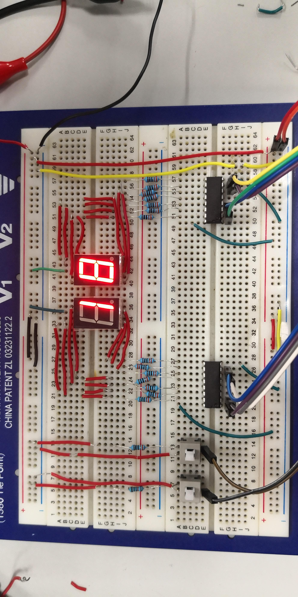

# digital-clock

本项目旨在帮助同学们**快速**完成**EEE116**数字时钟的代码开发。

## 先觉条件
 - 新版Arduino可能无法运行，请使用1.8.5版本(下载地址：[win](https://cloud.yimian.xyz/install/arduino/1.8.5/arduino-1.8.5-windows.zip) / [mac](https://cloud.yimian.xyz/install/arduino/1.8.5/arduino-1.8.5-macosx.zip))
 - 下载并解压代码到本地([代码下载戳这里](https://github.com/IoTcat/digital-clock/archive/master.zip))
 - **请务必先解压，否则代码无法运行**
 - 请保证包含代码文件的文件夹名称为`digital-clock`
 - 请保证你的两个开关线路使用**上拉电阻**，即按下时output输出高电压
## 相关资料
### 效果图

### 译码器连法
译码器与显示器连法(由[番茄树](https://tomatotrees.xyz)同学提供)

 
## 快速开始
 - 用Arduino IDE打开digital-clock.ino文件
 - 根据需求编辑`定义初始参数`部分
 - 代码其它部分如不明白请**不要改动**
 - 之后正常编译上传即可

## 参数说明
代码注释比较详细，我直接copy过来如下
````C++
/*** 定义初始参数 ****/

//小组组号
#define GROUP_ID 22 //计时器增大到此值将重新从零开始
                    //例如此处我的组号是22

//时钟变换时间间隔 (毫秒)
#define INTERVAL_TIME 1000 //默认是1秒

//pin口 - 接译码器1 (显示个位)
#define DIG_1_1 9   //A
#define DIG_1_2 10  //B
#define DIG_1_3 11  //C
#define DIG_1_4 12  //D

//pin口 - 接译码器2 (显示十位)
#define DIG_2_1 5   //A
#define DIG_2_2 6   //B
#define DIG_2_3 7   //C
#define DIG_2_4 8   //D

//pin口 - 接开关
#define SWI_OFF 3

//pin口 - 接reset键
#define SWI_RESET 4

````

## 背景资料
自豪地引用[**ovo.h**](https://github.com/eeeneko/arduino-ovo)搭建非阻塞Arduino程序框架！

## 已知bug
 - [] 部分nano板
 - [] 部分按钮开关需要长按才能识别
 - [x] reset键不灵敏
 - [x]

## Q & A
### 代码编译出现错误找不到`ovo.h`等
答：请保证压缩包中所有文件均在一个名为`digital-clock`的文件夹中！！之后通过arduino打开此文件夹中的digital-clock.ino即可。

### 编译错误中出现关键词`auto`
答：请确保你的arduino为1.8.5版本！！(下载地址：[win](https://cloud.yimian.xyz/install/arduino/1.8.5/arduino-1.8.5-windows.zip) / [mac](https://cloud.yimian.xyz/install/arduino/1.8.5/arduino-1.8.5-macosx.zip))

### 上传错误`avrdude: ser_open(): can't open device`
答：请在上方**工具**中选择指定**端口**。

### 上传错误`avrdude: stk500_recv(): programmer is not responding`
答：此错误由先前对端口的非正常操作引起。请尝试**重启系统**或**更换电脑**解决。

## 更新日志
### 2019/4/9
 - 修复reset按钮不灵敏的bug
 - 修复时钟显示问题

