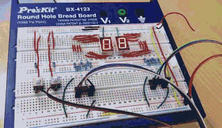
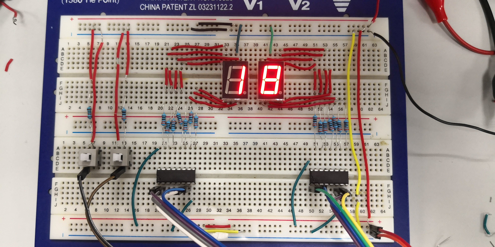
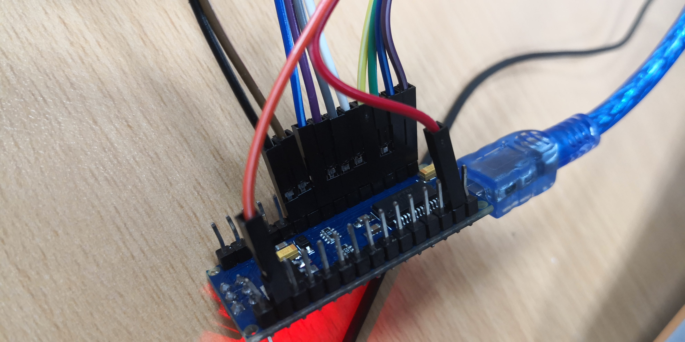
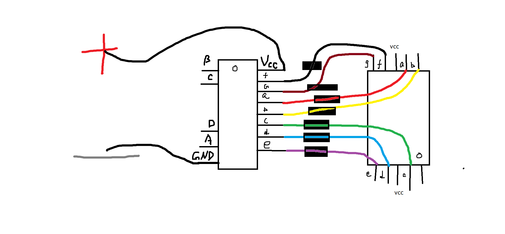
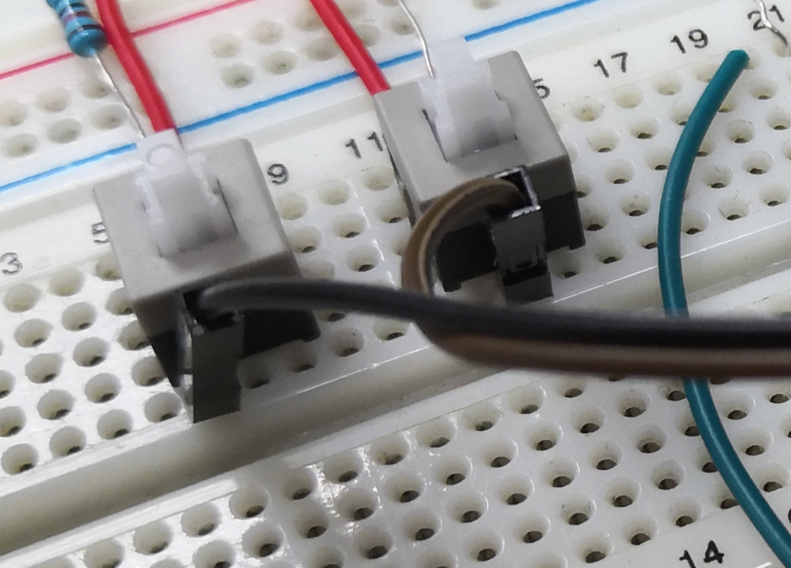
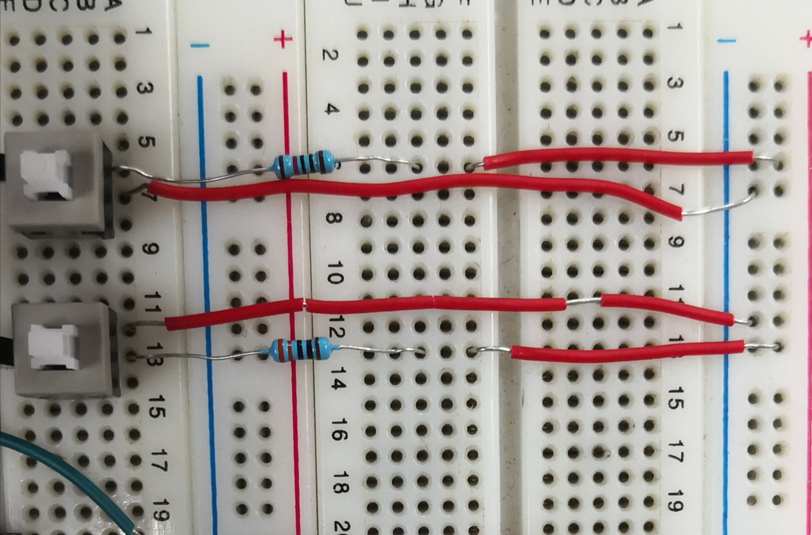

### 效果图

### 电路实物图
请参考以下图片搭建你的电路！

### Arduino Nano推荐连法

### 译码器连法
> 译码器与显示器连法(由[番茄树](https://tomatotrees.xyz)同学提供)

 - 推荐使用**D9,D10,D11,D12分别连接右边译码器的A,B,C,D**
 - 推荐使用**D5,D6,D7,D8分别接左边译码器A,B,C,D**

更多资料请查看附录[译码器电路示意图](/attach#译码器电路示意图)
 
### 开关电路说明
 - 说三遍：**开关是有方向的，开关是有方向的，开关是有方向的**
 - 请务必保证开关上**有突起**的一面**朝左**
 - 开关的具体接法可参考以下两张图
 - 在下图接法中，左边的开关用于**暂停**，右边的开关用于**重置**
 - 推荐使用**D3连暂停键，D4连reset键**
   
